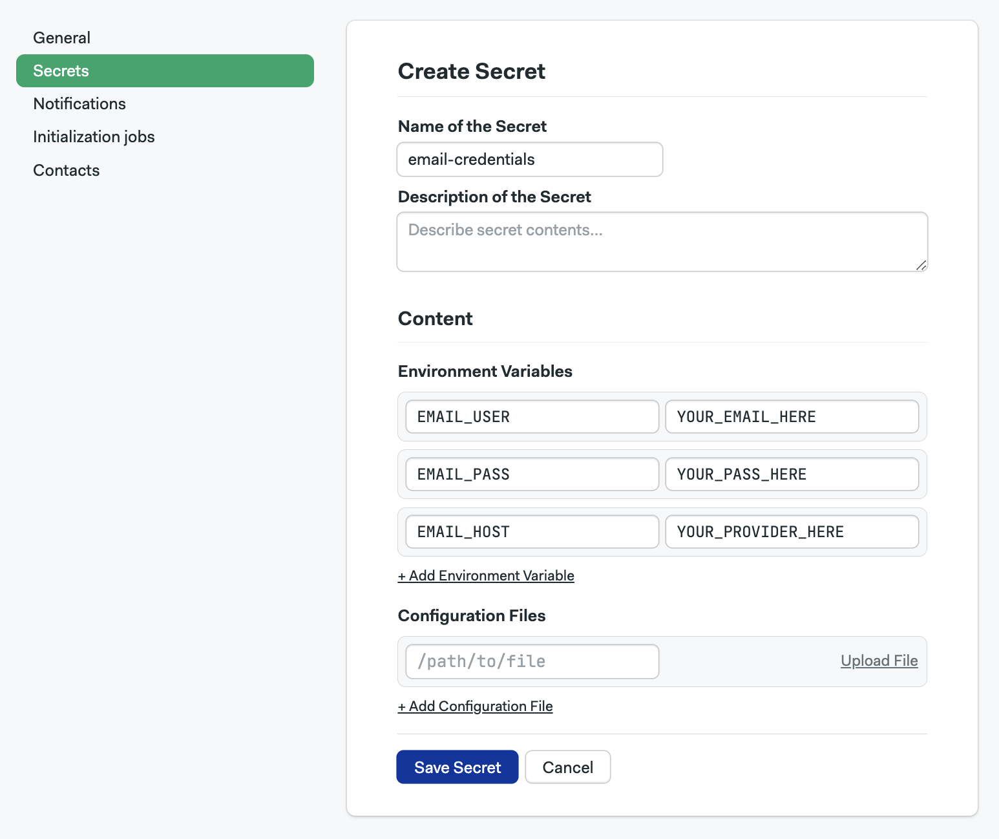
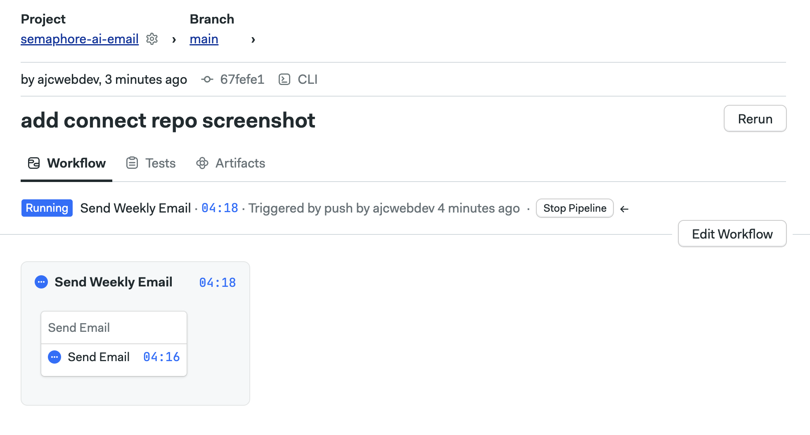
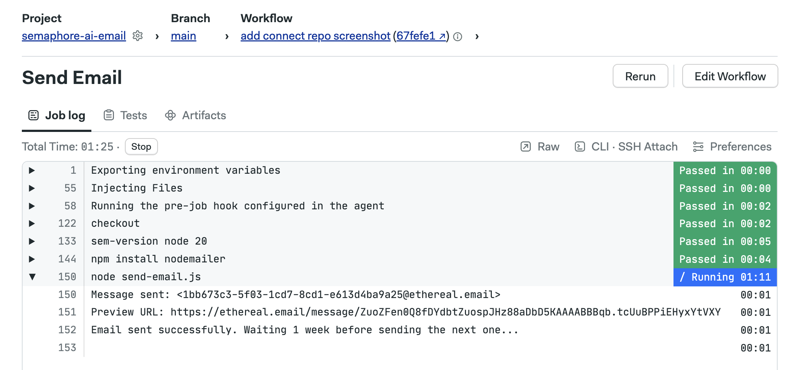
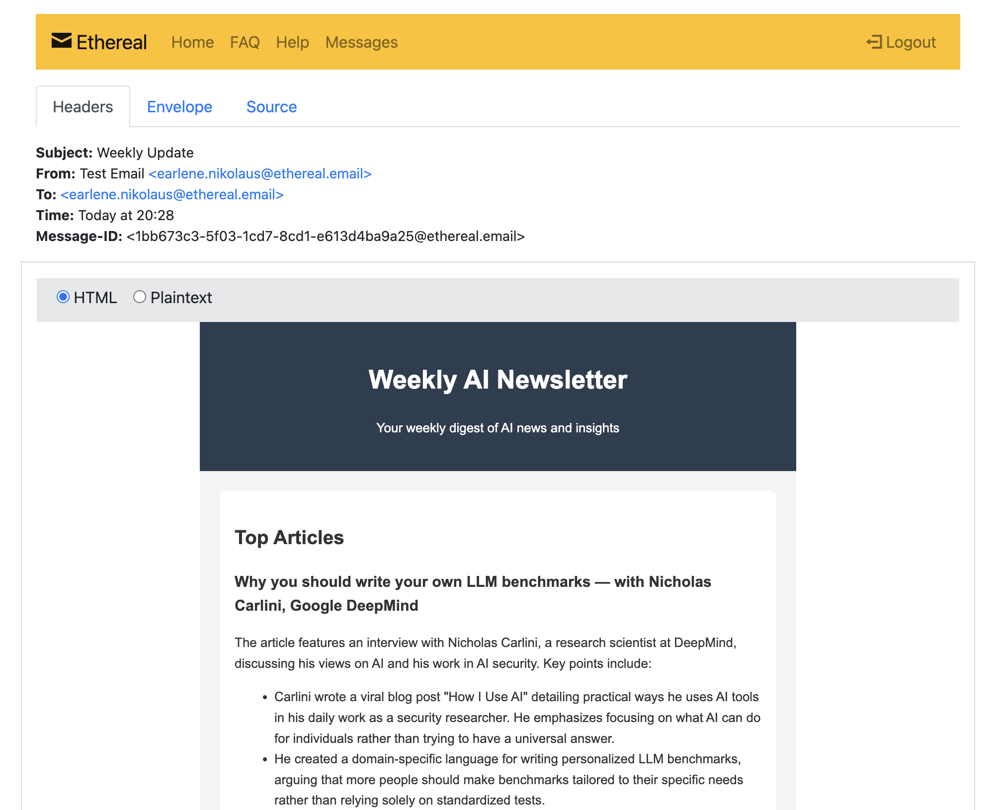

# Building an AI-Enabled Automated Email Summary System with CI/CD

## Project Setup

Clone repository, create a `.env` file, and install the project's dependencies:

```bash
git clone https://github.com/ajcwebdev/semaphore-ai-email.git
cd semaphore-ai-email
cp .env.example .env
npm i
```

Create an [Anthropic API key](https://docs.anthropic.com/en/api/getting-started) and include it in `.env`:

```bash
ANTHROPIC_API_KEY=""
```

Create a test email and password with [Ethereal](https://ethereal.email/):

```bash
EMAIL_USER=""
EMAIL_PASS=""
```

## Connect Project to Semaphore

Create a Semaphore account, open your organization settings, and navigate to the Secrets section:


Click "New Secret." Set your test email to `EMAIL_USER` and your password to `EMAIL_PASS`.



Click "Save Secret." Next, create a new project and connect the project to your GitHub repository:


This will start running your workflow:



Click "Send Email" to view the workflow logs:



Your logs should include a message saying, "Message sent" along with a preview URL. Open the preview URL to view the example email:


